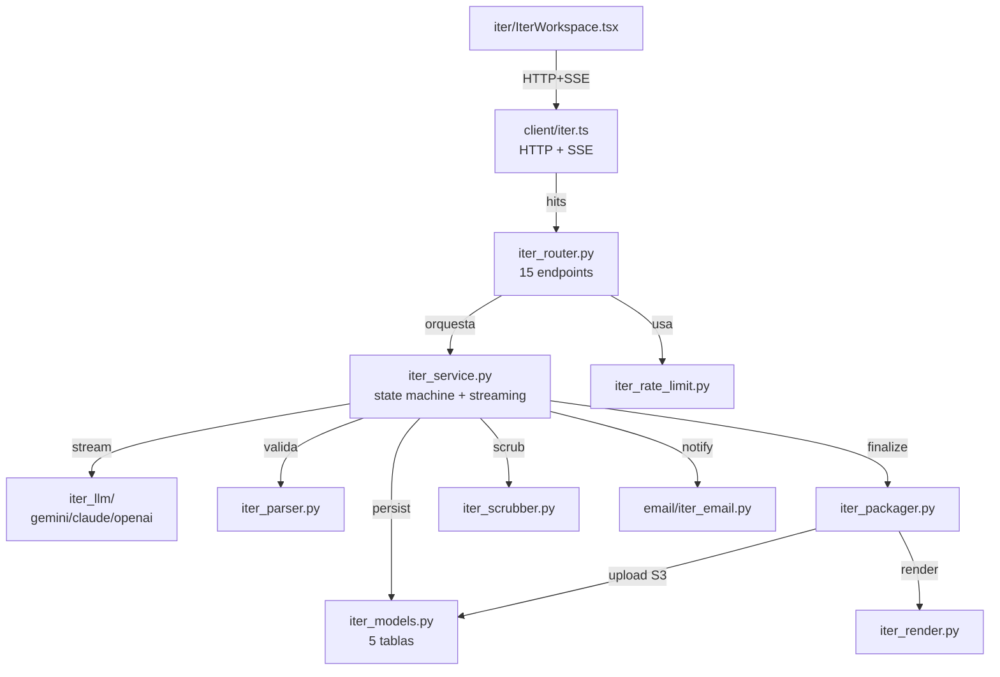

# Legacy Iter vs Chat Experience — análisis técnico y funcional
- **Date**: 2026-05-15 15:00
- **Document**: 20260515_1500_REPORT_legacy-iter-vs-chat-experience.md
- **Category**: REPORT
- **Sources**: `origin/feat/v0.4.0-canvas-and-converging-iter` (legacy iter, vivo en ese branch) + HEAD `feedback/lehidalgo/feedback-optimizations` (chat experience, post Sprint A/B/C)

Este informe responde, en orden, a las 7 preguntas que planteaste sobre Legacy + Chat Experience. Está construido leyendo el código real en ambos branches — sin asunciones, con citas `file:line`.

> **Cross-reference:** este documento es la **referencia técnica** (qué es cada cosa). Para el **checklist verificable de paridad funcional** + Sprint D recomendaciones + regresiones detectadas, ver
> `20260515_1530_REPORT_chat-experience-parity-checklist.md`. Ambos son complementarios: este describe arquitectura módulo a módulo y modelo de datos; el de paridad checklist marca gaps y fixes pendientes.

---

# Parte 1 — Análisis del Legacy de Iter

## 1.1 Arquitectura general del Legacy

### Módulos backend (Python / FastAPI)

| Módulo | LOC aprox | Responsabilidad |
|---|---|---|
| `iter_service.py` | 1414 | Orquestación: state machine `DRAFT → ITERATING → FINALIZED|ABANDONED`, run_iteration streaming, finalize, persist |
| `iter_router.py` | 779 | 15 endpoints HTTP, error → status mapping, DI |
| `iter_schemas.py` | 506 | Pydantic strict (`IterationOutput`, `Persona`, `UserStory`, `SpecDocument`, `Diagram`, `Assumption`, `DiffOperation`) |
| `iter_models.py` | 402 | SQLModel ORM — 5 tablas + 4 enums |
| `iter_packager.py` | 463 | Render 9 markdown files + ZIP + S3 upload |
| `iter_parser.py` | 322 | JSON parse, business-rule validation, repair-hint retry |
| `iter_scrubber.py` | 318 | Jargon scrubber con glossary rewrite + drop-threshold |
| `iter_render.py` | 150 | Render personas/user_stories/spec/diagram/iteration_log a Markdown |
| `iter_rate_limit.py` | 194 | Per-session + per-user-week budgets, in-process cache 30s TTL |
| `iter_sse.py` | 134 | Wire format SSE (token / section / heartbeat / error / done) |
| `iter_differ.py` | 61 | Diff ops invariants (rechaza `remove` si `restructure_allowed=false`) |
| `iter_prompts/system_v1.py` | 443 | System prompt v1 — biz-user → senior-dev contract |
| `iter_prompts/user_builder.py` | 221 | Compose user prompt: glossary + original feedback + technical_metadata + previous_versions + resolved_assumptions + user_iteration_message + restructure_allowed |
| `iter_llm/protocol.py` | 157 | `LLMProvider` Protocol + `LLMResult` + `LLMUsage` + `LLMAttachment` + `RawTrace` |
| `iter_llm/factory.py` | 72 | Provider factory: gemini/claude/openai/fake desde env var |
| `iter_llm/{gemini,claude,openai,fake}.py` | ~150 c/u | Adapters streaming + non-stream `generate` |
| `email/iter_email.py` | 51 | Email template post-finalize con presigned ZIP URL |

### Módulos frontend (React / TypeScript)

| Módulo | Responsabilidad |
|---|---|
| `iter/IterWorkspace.tsx` | UI admin de 3 columnas (sidebar + editor + output), monta tabs Document/Assumptions/Activity |
| `iter/SpecTabsPanel.tsx`, `SpecSectionCard.tsx`, `specSectionState.ts` | Render sections con skeleton → streaming → done |
| `iter/markdownView.tsx` | Lazy-load markdown-it + sanitize |
| `iter/useChatTimeline.ts`, `useIterRunMeta.ts`, `useIterRunStream.ts` | Hooks de timeline + metadata + SSE state-machine |
| `client/iter.ts` | HTTP/SSE SDK (startIterSession, listIterVersions, resolveIterAssumption, finalizeIterSession, getIterPackage) |
| `client/types.ts` | Espejo TS de los Pydantic types |
| `admin/FeedbackTriagePage.tsx` | `IterSessionsSection` lista sesiones por feedback con botones Open / Download |

### Host integration

`register_feedback_iter_router(app, auth, engine, prefix)` en `__init__.py:191-250` monta el router paralelo al feedback router bajo `{prefix}/iterate/...`. Gated por `FEEDBACK_ITER_ENABLED=true`.

### Dependencias externas

- **Python**: FastAPI, SQLModel (sync session por ADR-006), Pydantic, boto3 (S3 copy_object + presigned), `google-genai` / `anthropic` / `openai` (optional extras per provider)
- **TS**: `@tanstack/react-query`, `markdown-it` lazy, `lucide-react`

### Patrones de diseño

- **Protocol-based providers**: `LLMProvider` Protocol runtime-checkable, factory selecciona por env
- **State machine** explícita con tabla `_TRANSITIONS` (`iter_service.py:~110`) que bloquea estados terminales
- **Idempotency replay** doble: sesión idempotente por `feedback_id` (partial unique index), iteración idempotente por `Idempotency-Key` header con replay de eventos SSE
- **SSE streaming** con heartbeats periódicos para sobrevivir nginx/Traefik idle timeouts
- **Parse + repair-hint retry**: si JSON inválido, segundo LLM call con hint compacto (max 2 retries)
- **Server-side scrub** con dos políticas: rewrite vía glossary cuando hay mapeo + drop si density > 50%
- **Append-only versions**: cada iteración INSERTa `feedback_iter_version`, nunca UPDATE — historial completo
- **Slot-key carry-over**: `Assumption.slot_key` estable entre versiones para heredar resolución del usuario
- **Audit trail granular**: `feedback_iter_call` registra cada attempt (success o fail) con tokens, latency, prompt_sha256, scrub_log

### Mapa de conexiones (Mermaid)



---

## 1.2 Modelo de datos del Legacy

### Tablas SQL (5)

#### `feedback_iter_session` — workspace de iteración

| Columna | Tipo | Constraint |
|---|---|---|
| id | UUID | PK |
| feedback_id | UUID | FK → feedback.id ON CASCADE |
| tenant_id | UUID | nullable |
| created_by_user_id | UUID | indexed |
| status | ENUM | DRAFT / ITERATING / FINALIZED / ABANDONED |
| model_id | str(200) | snapshot del modelo a session create |
| model_provider | str(50) | gemini / claude / openai |
| language | str(10) | default "en" |
| current_iteration_id | UUID | puntero manual a versión activa (sin FK formal) |
| final_package_id | UUID | puntero al package finalizado |
| created_at / updated_at / finalized_at | timestamp | tz-aware |

**Índice clave**: partial UNIQUE `(feedback_id) WHERE status NOT IN ('finalized','abandoned')` → una sola sesión activa por feedback.

**Ciclo de vida**: INSERT en `POST /sessions` (idempotente); UPDATE de status al correr iteraciones / finalize / abandon; CASCADE delete desde feedback.

#### `feedback_iter_version` — snapshot append-only por iteración

| Columna | Tipo | Constraint |
|---|---|---|
| id | UUID | PK |
| session_id | UUID | FK → session.id ON CASCADE |
| version_number | int | monotónico 1-based |
| parent_version_id | UUID | FK self ON SET NULL (linaje) |
| user_message | text | instrucción del turno |
| restructure_allowed | bool | permite `remove` ops |
| output_json | JSONB | `IterationOutput` completo validado |
| output_markdown | text | denormalización de `markdown_rendered` |
| diff_json | JSONB | `[DiffOperation]` |
| is_complete | bool | señal del modelo |
| completion_reason | text | explicación user-facing |

**Constraint**: UNIQUE `(session_id, version_number)`.

**Ciclo de vida**: INSERT tras LLM call exitoso; **inmutable** (append-only); UPDATE solo cuando admin edita markdown manualmente post-finalize.

#### `feedback_iter_call` — audit trail por llamada LLM

| Columna | Tipo | Constraint |
|---|---|---|
| id | UUID | PK |
| session_id | UUID | FK → session.id ON CASCADE |
| version_id | UUID | FK → version.id ON SET NULL (null si call falló) |
| model_id, model_provider | str | qué modelo respondió |
| input_tokens, output_tokens | int | usage |
| cost_usd | Numeric(12,6) | pricing |
| latency_ms | int | wall-clock |
| status | ENUM | SUCCESS / JSON_INVALID / TIMEOUT / PROVIDER_ERROR / CANCELLED |
| attempt_number | int | 1 = initial, 2 = repair retry |
| error_message | text | si status != SUCCESS |
| prompt_sha256 | str(64) | hash del prompt completo |
| idempotency_key | str(128) | header HTTP para replay |
| scrub_log | JSONB | array de rewrites/drops |

**Índice**: partial UNIQUE `(session_id, idempotency_key) WHERE idempotency_key IS NOT NULL`.

#### `feedback_iter_assumption` — hipótesis del modelo

| Columna | Tipo | Constraint |
|---|---|---|
| id | UUID | PK |
| version_id | UUID | FK → version.id ON CASCADE |
| slot_key | str(200) | identificador estable cross-version |
| kind | ENUM | TECHNICAL / BUSINESS / UX / SCOPE |
| statement, rationale | text | qué + por qué |
| confidence | Numeric(3,2) | 0.00–1.00 |
| status | ENUM | OPEN / CONFIRMED / CORRECTED / IRRELEVANT |
| user_response | text | si status=CORRECTED |
| resolved_at, resolved_by_user_id | timestamp/UUID | quién resolvió |
| options | JSONB | radio buttons 2-4 si multiple-choice |

**Constraint**: UNIQUE `(version_id, slot_key)`.

#### `feedback_iter_package` — paquete finalizado inmutable

| Columna | Tipo | Constraint |
|---|---|---|
| id | UUID | PK |
| session_id | UUID | FK → session.id ON CASCADE, UNIQUE (1 package/sesión) |
| final_version_id | UUID | FK → version.id ON RESTRICT (protege versión final) |
| minio_zip_key, minio_folder_prefix | str(1024) | S3 paths |
| byte_size_zip | bigint | tamaño |

### Output Pydantic (`IterationOutput`)

Estructura raíz `IterationOutput(extra="forbid")`:
- `schema_version: Literal["1"]`, `language: Literal["en"]`
- `personas: list[Persona]` (≤3) — id, name, role, goals[], pain_points[], context
- `user_stories: list[UserStory]` (≤15, ≤5 por persona) — id, persona_id, title, story, acceptance_criteria[GherkinScenario]
- `spec: SpecDocument` — title, summary, sections[{id, heading, body_markdown}]
- `diagram: Diagram` — format (ascii|mermaid), source, caption
- `assumptions: list[Assumption]` — slot_key, kind, statement, rationale, confidence, options[]
- `diff: list[DiffOperation]` discriminated union (add | modify | remove | mark_obsolete) + RFC-6901 path
- `unresolved_questions: list[str]`
- `archived: list[ArchivedItem]` (soft-removed con restructure_allowed=true)
- `changes_summary: str`
- `is_complete: bool`, `completion_reason: str`
- `markdown_rendered: str` (denormalizado a `output_markdown`)

### Frontend types (`client/types.ts`)

`IterSessionRead`, `IterVersionRead`, `IterAssumptionRead`, `IterPackageRead`, `IterDiffOp` discriminated union, enums espejo (`IterSessionStatus`, `IterCallStatus`, `IterAssumptionKind`, `IterAssumptionStatus`).

### Invariantes

- Una sola sesión no-terminal por feedback (partial unique index)
- Versions monotónicas por sesión
- 1 package por sesión (UNIQUE)
- Idempotencia de calls por (session, idempotency_key)
- Assumptions identificadas estable por slot_key → herencia de resolución cross-version

---

## 1.3 Flujos funcionales del Legacy

### Flujo A — Iniciar sesión

- **Entry**: `POST /iterate/sessions` (iter_router.py:~300)
- **Pre-checks**: ownership del feedback, idempotencia (reutiliza sesión activa si existe)
- **Writes**: INSERT `FeedbackIterSession(status=DRAFT, model_id, model_provider, language)`
- **Out**: `IterSessionRead` con campos computados (remaining_turns, last_call_model_id)

### Flujo B — Ejecutar iteración (LLM stream)

- **Entry**: `POST /iterate/sessions/{sid}/iterations` con header `Idempotency-Key`
- **Pre-checks (sync)**: ownership, status runnable, no assumptions OPEN, turn budget no agotado
- **Idempotency replay**: si `Idempotency-Key` + status=SUCCESS existe en `FeedbackIterCall` → replay eventos desde `output_markdown` sin LLM call (iter_service.py:~415)
- **Rate limit**: `check_session_total + check_user_week` → 429 si excede (iter_rate_limit.py)
- **Stream (async)**:
  - Build user prompt con prior versions + resolved assumptions + technical_metadata + glossary
  - `provider.stream()` → emite chunks
  - SSE events: `provider_active` (modelo arrancando), `token` (chunks), `section` (headings detectados por `SectionDetector` en iter_sse.py), `provider_fallback` (si fallback chain consume modelo)
- **Parse + retry**: `parse_iteration_output()` valida JSON + business rules (FK refs, unique keys, destructive-removal); en fail → repair-hint + segundo intento
- **Scrub**: `scrub_assumptions` + `scrub_questions` (rewrite vía glossary | drop si density ≥ 0.5)
- **Persist success** (atomico):
  - `FeedbackIterVersion` row con output_json + output_markdown + diff_json + is_complete
  - `FeedbackIterAssumption` rows (upsert por slot_key, hereda status si prior version tenía mismo slot)
  - `FeedbackIterCall` audit row (tokens, latency, prompt_sha256, scrub_log)
  - UPDATE `FeedbackIterSession.status=ITERATING, current_iteration_id, updated_at`
  - `rate_limit.record_call`
- **Persist failure**: solo `FeedbackIterCall` con `status=PROVIDER_ERROR|JSON_INVALID|TIMEOUT|CANCELLED`, `version_id=NULL`, error_message[:5000]
- **Errores conocidos**: `IterAssumptionsOpenError`, `IterTurnBudgetExhaustedError`, `IterRateLimitExceededError`, `LLMProviderError`

### Flujo C — Resolver assumptions

- **Entry**: `PATCH /assumptions/{id}` con `{status, user_response?}`
- **State machine**: `OPEN → CONFIRMED | CORRECTED | IRRELEVANT` (no permite volver a OPEN)
- **Write**: UPDATE assumption con status + user_response + resolved_at + resolved_by_user_id

### Flujo D — Finalize

- **Entry**: `POST /iterate/sessions/{sid}/finalize`
- **Pre-checks**: idempotencia (si ya FINALIZED → retorna package existente); requiere `current_iteration_id` no nulo; transition DRAFT|ITERATING → FINALIZED
- **Build**: render 9 markdown files (`README.md`, `_AI_INSTRUCTIONS.md`, `00_context.md`, `01_personas.md`, `02_user_stories.md`, `03_spec.md`, `04_diagram.md`, `05_assumptions_resolved.md`, `06_iteration_log.md`) vía `iter_packager.build_iter_package` + `iter_render.*`
- **Upload**: ZIP + cada markdown a MinIO bajo `feedback/YYYY/MM/DD/{feedback_id}/iter/sessions/{sid}/packages/{pid}/`
- **Persist**: INSERT `FeedbackIterPackage` + UPDATE session (status=FINALIZED, finalized_at, final_package_id)
- **Email** (background si `ITER_NOTIFY_ON_FINALIZE=true`): `build_iter_finalized_email` con presigned ZIP URL

### Flujo E — Editar markdown post-iteración

- **Entry**: `PATCH /sessions/{sid}/iterations/{vid}/markdown`
- **Restricciones**: sólo última version (==`session.current_iteration_id`), sólo si session no terminal
- **Write**: UPDATE `output_markdown`; stamp `manually_edited=true`, `manually_edited_at`, `manually_edited_by` dentro de `output_json`

### Flujo F — Abandonar

- **Entry**: `PATCH /sessions/{sid}/abandon`
- **Write**: UPDATE status=ABANDONED, abandoned_at — idempotente

### Casos borde

- Idempotency-Key collision → replay (no consume turno ni budget)
- Scrub drop-all → version persiste con assumptions vacíos (no es error)
- Provider fallback chain → SSE emite walk completo antes de probar siguiente
- State transitions inválidos → `IterStateError`
- Slot-key carry-over → resoluciones previas se replican automáticamente

---

## 1.4 User Journeys del Legacy

Perfil único: **MASTER_ADMIN** validando/refinando feedback raw.

### J1 — Start iter session

1. Admin abre feedback en `FeedbackTriagePage` → ve sección `IterSessionsSection`
2. Click `[Start new iteration]` → URL gana `?startIter=<fid>` + dispara `PopStateEvent`
3. Host route monta workspace → `startIterSession({ feedback_id })`
4. Backend retorna `IterSessionRead{id, status="draft"}`
5. URL pivota a `?iter=<sid>` → `IterWorkspace` monta

### J2 — Run iteration turn

1. Admin en `IterWorkspace` → tab `Document` → textarea `user_message` + checkbox `restructure_allowed`
2. Click `[Run iteration]` o `[Generate first version]` → `useIterRunStream.start(...)`
3. POST SSE: backend emite `provider_active → token → section → token → done`
4. Reducer: `status: idle → running → done`, `partialMarkdown` acumula, `sectionStates[personas].status` progressivo
5. `SpecSectionCard` renderiza con skeleton → animated pulse → markdown final
6. Invalidate queries → carga `IterVersionRead` + `IterAssumptionRead[]`

### J3 — Resolve assumptions

1. Tab `Assumptions` → `AssumptionCard` con status=OPEN
2. Tres acciones:
   - `[Confirm]` → confirmed
   - `[Edit]` → textarea → `[Submit]` → corrected + user_response
   - `[Mark irrelevant]` → irrelevant
   - Si `options[]` exists → radio buttons → corrected + user_response=selección
3. PATCH `/assumptions/{aid}` → row update
4. Invalidate refetch → card cambia badge o desaparece
5. `[✎ Change my answer]` permite re-resolver

### J4 — Edit version markdown

1. `EditableSpecPanel` → `[Editar]` (si editable)
2. Textarea muestra `output_markdown`
3. Admin edita → `[Guardar]` → PATCH `/versions/{vid}/markdown`
4. Backend persiste + recomputa diff_json
5. Invalidate → re-render

### J5 — Finalize

1. Precondiciones: latestVersion exists, openAssumptionCount=0, `needsReviewIteration=false`
2. Footer `[Finalize]` habilitado → POST `/finalize`
3. Backend: build ZIP, S3 upload, INSERT package, UPDATE session, email
4. setQueryData del package → status badge → finalized
5. Footer reemplaza `[Finalize]` por `[Download ZIP]`

### J6 — Download package

1. Click `[Download]` → `getIterPackage(sid)` → `IterPackageRead{presigned_zip_url}`
2. Anchor `<a download>` dispara browser download
3. Toast "Download started"
4. Riesgo: presigned URL TTL ~24h

### J7 — Resume in-flight

1. Admin click `IterSessionRow` → URL `?iter=<sid>`
2. `IterWorkspace` monta → queries paralelas: `getIterSession + listIterVersions + listIterAssumptions`
3. Tabs reconstituyen estado (Document/Assumptions/Activity)
4. Admin puede continuar iterando si status != terminal

### Puntos de fricción observados

- `needsReviewIteration`: tras resolver assumptions, admin debe correr iteración "review" antes de finalize (puede ser confuso)
- Technical assumptions filtradas — UX confuso si admin no entiende `kind=technical` son AI-internals
- Presigned URL expiry → download falla si usuario tarda >24h
- Streaming silent timeout → si SSE muere sin heartbeat visible, UI cuelga

---

# Parte 2 — Análisis de la nueva Chat Experience

## 2.1 Arquitectura de la Chat Experience

### Backend (FastAPI)

| Módulo | Responsabilidad |
|---|---|
| `chat_router.py` | 7 endpoints: POST /chat/sessions, GET in-progress, GET sessions/{sid}, POST messages SSE, POST confirm, POST abandon, POST voice |
| `chat_service.py` | `ChatService.start_session` + `run_turn` (async generator) + `confirm_session` + `abandon_session` |
| `chat_models.py` | 2 tablas SQLModel: `FeedbackChatSession` + `FeedbackChatCall` (Sprint C audit) |
| `chat_schemas.py` | Pydantic: `AutoContext`, `ChatSynthesis` (strict, Sprint C), `ChatSynthesisPersona`, `ChatMessageRequest`, `ConfirmChatSessionRequest` |
| `chat_prompts/capture_prompt.py` | `CAPTURE_SYSTEM_PROMPT` v3 inglés + `{BRAND}`, `{GLOSSARY}`, `{LANGUAGE}` placeholders |
| `chat_prompts/user_builder.py` | OpenAI-style messages array + auto_context block turn 1 + multimodal screenshot |
| `chat_turn_parser.py` | Parse JSON + validate `ChatSynthesis.model_validate` + repair-hint loop (max 2 retries) |
| `chat_whisper.py` | OpenAI Whisper proxy: glossary hint, hallucination filter, audio nunca persistido (D-013) |
| `scrubber.py` (renombrado de `iter_scrubber.py`) | `scrub_questions` con drop-threshold + glossary rewrite |
| `llm/` (renombrado de `iter_llm/`) | LLMProvider Protocol + adapters Gemini/Claude/OpenAI/Fake |
| `service.py` (legacy + Sprint A helpers) | `upload_feedback_attachment`, `check_user_rate_limit`, `generate_ticket_code` (extracted, public) |
| `bundle.py` (Sprint C refactor) | ZIP handoff sin deps iter — incluye chat session export |

### Frontend (React)

| Módulo | Responsabilidad |
|---|---|
| `FeedbackChatSheet.tsx` | Sheet con shell-hybrid: header + tabs Nuevo/Mis feedbacks + CAPTURE picker + chat |
| `useFeedbackChat.ts` | State hook principal: session lifecycle, screenshot capture, diagnostics install, confirm body con base64 |
| `useChatRunStream.ts` | SSE consumer del turn endpoint |
| `ChatTimeline.tsx` + `ChatBubble.tsx` + `Composer.tsx` | UI conversación |
| `SynthesisCard.tsx` | Render rico: personas, user_stories, acceptance_criteria, assumptions, mermaid diagram, open_questions |
| `CapturePicker.tsx` | Element picker (locked element con outerHTML snapshot Sprint B) |
| `VoiceRecorder.tsx` | Mic + AnalyserNode waveform Claude-style |
| `capture/diagnostics.ts` (Sprint B) | console.error/warn hooks + fetch/XHR ring buffers + framework fingerprint + outerHTML snapshot util |
| `capture/screenshot.ts` | `capturePageScreenshot` con `data-feedback-widget-root` exclusion + redactionSelectors |
| `client/idempotency.ts` (Sprint C extracted) | `newIdempotencyKey` reutilizable |

### Endpoints HTTP

| Verb | Path | Propósito |
|---|---|---|
| POST | `/chat/sessions` | Create + return greeting + resume_available flag |
| GET | `/chat/sessions/in-progress` | Lista sesiones IN_PROGRESS del user (D-014) |
| GET | `/chat/sessions/{sid}` | Detail completo (resume) |
| POST | `/chat/sessions/{sid}/messages` | SSE stream de un turn (idempotency 1h TTL D-021) |
| POST | `/chat/sessions/{sid}/confirm` | Crea feedback row (Sprint A: redact + rate limit + screenshot upload + email) |
| POST | `/chat/sessions/{sid}/abandon` | Mark abandoned (fire-and-forget) |
| POST | `/chat/sessions/{sid}/voice` | Whisper transcription multipart (max 5MB) |
| GET | `/api/v1/feedback/{id}/chat` | **Admin** (Sprint C): conversación + synthesis + call audit |

### Dependencias

Mismas que legacy + nuevas: OpenAI Whisper (S4), AnalyserNode + MediaRecorder (FE voice), tsup build.

### Patrones

- **Single LLM call per turn** (D-006, no LangGraph) — `run_turn` async generator yields events
- **Native messages array** OpenAI-style en lugar de tagged-block string (parity legacy es `_serialise_user_payload`)
- **Multimodal screenshot** per-turn (Sprint B) en lugar de adjunto attachment-id
- **Coverage tracking** 8-dim auto-evaluado con early-exit @0.7
- **Mode discover|synthesize** explícito en JSON output (vs implicit en iter)
- **Strict Pydantic ChatSynthesis** con `extra="ignore"` (Sprint C) — typed enrichment opcional
- **Idempotency replay** in-memory dict (proceso-local) en lugar de DB-backed
- **Audit FeedbackChatCall** Sprint C — paridad observability con `feedback_iter_call`

## 2.2 Modelo de datos de la Chat Experience

### Tabla `feedback_chat_session`

| Columna | Tipo | Notas |
|---|---|---|
| id | UUID PK | session ID |
| tenant_id | UUID nullable | multi-tenant |
| user_id | UUID indexed | submitter |
| mode | ENUM | CAPTURE / REFINE |
| status | ENUM | OPEN / IN_PROGRESS / SYNTHESIZING / AWAITING_CONFIRM / CONFIRMED / ABANDONED |
| messages | JSONB | `[{role, text, ts, mode?, covered?, inferred?}]` |
| synthesis_json | JSONB nullable | `ChatSynthesis` struct |
| auto_context | JSONB | browser snapshot |
| feedback_id | UUID FK nullable | link to `feedback` row post-confirm |
| glossary_snapshot | JSONB nullable | frozen Sprint B |
| detected_language | str(8) | D-009 — del primer Whisper |
| created_at / updated_at / confirmed_at / abandoned_at | timestamps | lifecycle |

### Tabla `feedback_chat_call` (Sprint C — paridad legacy `feedback_iter_call`)

| Columna | Tipo | Notas |
|---|---|---|
| id | UUID PK | call ID |
| chat_session_id | UUID FK ON CASCADE | parent |
| turn_index | int | which user turn |
| model_id / model_provider | str | LLM identity |
| input_tokens / output_tokens | int | usage |
| cost_usd | float nullable | pricing |
| latency_ms | int | wall-clock stream |
| status | ENUM | SUCCESS / JSON_INVALID / TIMEOUT / PROVIDER_ERROR / CANCELLED |
| attempt_number | int | retries |
| error_message | text nullable | failure detail |
| prompt_sha256 | str(64) | hash |
| prompt_version | str(32) | `capture_v3` |

### Enriquecimiento de `feedback` (Sprint A)

| Columna | Tipo | Notas |
|---|---|---|
| chat_session_id | UUID FK → feedback_chat_session.id | NULL para legacy multipart |
| synthesis_json | JSONB nullable | redacted copy |
| severity | ENUM | blocker/major/minor/idea inferido por LLM |

Element columns existentes (`element_selector`, `element_xpath`, `element_bounding_box`) ahora también se popularán desde `auto_context` en Sprint A.

### Shape `messages` JSONB

```jsonc
// user turn
{ "role": "user", "text": "...", "ts": "ISO8601" }

// assistant turn
{ "role": "assistant", "text": "(scrubbed)",
  "mode": "discover|synthesize",
  "active_branch": "1|2|3|4|5|6|leaf",
  "covered": { "problem":0..1, "context":0..1, "expectation":0..1,
               "reality":0..1, "impact":0..1, "change":0..1,
               "example":0..1, "importance":0..1 },
  "inferred": { "type": "bug|...", "severity": "blocker|..." },
  "ts": "ISO8601" }
```

### Shape `synthesis_json` (== `ChatSynthesis` Pydantic, Sprint C strict)

```jsonc
{
  // required base
  "title": str (≤200),
  "summary": str (≤4000),
  "user_story": str (≤1000),
  "context": str (≤2000),
  "user_need": str (≤2000),
  "acceptance_criteria": list[str] (≤20),
  "open_questions": list[str] (≤20),
  // optional enrichment
  "personas": list[ChatSynthesisPersona{name, goal, frustration}] (≤5),
  "user_stories": list[str] (≤10),
  "assumptions": list[str] (≤15),
  "diagram": str | null (≤8000, optional Mermaid)
}
```

### Shape `auto_context` (Sprint B expanded)

```jsonc
{ "url": str, "route": str | null,
  "viewport": { w, h, dpr } | null,
  "app_version": str | null, "git_commit_sha": str | null,
  "user_role": str | null,
  "framework": "next.js|react|vue|null",
  "console_tail": list[str] (≤20),
  "network_errors_tail": list[str] (≤20),
  "element_selector": str | null,
  "element_xpath": str | null,
  "element_bounding_box": {x,y,w,h} | null,
  "element_outer_html": str | null (≤4096) }
```

---

# Parte 3 — Diff comparativa Legacy vs Chat

## 3.1 Tabla resumen

| Dimensión | Legacy iter | Chat Experience | Reutilización |
|---|---|---|---|
| **Trigger** | Admin abre feedback existente y "Start iteration" | Submitter abre widget desde su pantalla | NUEVO submitter-driven |
| **Sesión** | `feedback_iter_session` (1 por feedback, multi-turn) | `feedback_chat_session` (1 por chat, multi-turn) | misma idea, schema separado |
| **Versions** | `feedback_iter_version` append-only por turn | `messages` JSONB inline (sin versioning) | simplificado |
| **Audit calls** | `feedback_iter_call` | `feedback_chat_call` (Sprint C) | **paridad** |
| **Assumptions** | tabla `feedback_iter_assumption` granular, slot_key estable, status machine | inline en `synthesis.assumptions: list[str]` | simplificado (no resolución usuario) |
| **Package final** | `feedback_iter_package` + ZIP S3 | feedback row directamente + ZIP via `bundle.py` Sprint C | **refactor** |
| **System prompt** | `system_v1` ~8100 chars inglés, spec-writer role | `capture_v3` ~1200 chars inglés grill-me + audience contract | **rebuilt** |
| **Output shape** | `IterationOutput` Pydantic extra="forbid" | `ChatSynthesis` Pydantic extra="ignore" | parity tipo + lenient |
| **User prompt** | tagged blocks XML-like 8 secciones | OpenAI messages array + auto_context turn 1 + screenshot per turn | **rebuilt** |
| **Coverage** | implicit (model dice `is_complete`) | explicit 8-dim auto-grading + early-exit | **nuevo** |
| **Mode** | implícito en JSON shape | `discover\|synthesize` explícito | **nuevo** |
| **Idempotency** | DB-backed `idempotency_key` column con replay SSE | in-memory dict 1h TTL (D-021) | rediseño |
| **Streaming** | SSE token + section + heartbeat | SSE delta + turn_done + synthesizing + synthesis | parity wire format |
| **Repair-hint** | parse_iteration_output + retry | `parse_with_repair` max 2 | **reusado patrón** |
| **Scrubber** | `iter_scrubber.scrub_assumptions + scrub_questions` | `scrubber.scrub_questions` solo (Sprint C simplificó) | **reusado renombrado** |
| **Rate limit** | per-session + per-user-week (iter_rate_limit) | per-user-hour reutilizado de POST /feedback legacy | simplificado |
| **Redaction** | implícito en prompt | explícito server-side antes de persist (Sprint A) | **nuevo** |
| **Screenshot** | adjunto attachment-id en S3 | base64 inline en confirm body → upload S3 (Sprint A) | **rebuilt** |
| **Email** | finalize email con presigned ZIP URL | confirm email con screenshot inline + admin deep-link | parity |
| **Voice input** | no soportado | Whisper proxy + AnalyserNode waveform (S4) | **nuevo** |
| **Admin viz** | IterWorkspace 3 columnas | GET /feedback/{id}/chat (BE only — viewer FE pendiente) | rediseño pendiente |
| **Glossary** | injection en system prompt | snapshot frozen en session + injection prompt (Sprint B) | **reusado + frozen** |
| **Element capture** | technical_metadata.selected_element_selector + outer_html | auto_context.element_* + outer_html (Sprint B) | **reusado expandido** |
| **Browser diagnostics** | console_errors_tail + network_errors_tail en technical_metadata | mismo en auto_context (Sprint B) | **reusado** |

## 3.2 Qué partes del Legacy se reutilizan

| Componente | Cómo se reutiliza |
|---|---|
| `LLMProvider` Protocol + factories | renombrado `iter_llm/ → llm/`, mismas firmas (Sprint C) |
| Scrubber jargon + glossary rewrite | renombrado `iter_scrubber.py → scrubber.py`, drop `scrub_assumptions` (sólo `scrub_questions`) |
| Idempotency-Key pattern | extraído `client/idempotency.ts` para `newIdempotencyKey` |
| Rate limiting | mismo `check_user_rate_limit` reusable Sprint A |
| Audit row shape (model_id, tokens, latency, prompt_sha256) | `feedback_chat_call` paridad estructural (Sprint C) |
| Repair-hint retry loop | mismo patrón en `chat_turn_parser.parse_with_repair` |
| Email helpers (`build_feedback_email`, `enqueue_notification`) | reutilizado Sprint A 1:1 |
| S3 upload helpers (`upload_feedback_attachment`) | extraído Sprint A 1:1 |
| Element picker + outer_html snapshot | reused FE component, expandido Sprint B |
| Browser diagnostics (console / network) | reused concept, hooks nuevos `capture/diagnostics.ts` |
| Forbidden words list | mismo CSV `ITER_FORBIDDEN_WORDS` setting (env var name conservado) |
| Glossary host config | mismo `ITER_GLOSSARY` setting (env var name conservado) |

## 3.3 Qué partes del Legacy se eliminan / reemplazan

| Componente | Decisión | Reemplazo |
|---|---|---|
| `iter_router.py` + 15 endpoints | **borrado** Sprint C | `chat_router.py` con 7 endpoints chat-first |
| `iter_service.py` orchestration | **borrado** | `chat_service.py` (single call per turn vs multi-call) |
| `iter_models.py` + 5 tablas | **borrado** + migration 0009 DROP | `feedback_chat_session` + `feedback_chat_call` |
| `IterationOutput` Pydantic schema | **borrado** | `ChatSynthesis` Pydantic (estructura similar, simplificada) |
| Assumption resolution workflow | **borrado** (table + UI + state machine) | assumptions inline en synthesis sin resolución |
| Version history append-only | **borrado** | sólo messages JSONB (one-shot synthesis) |
| `IterWorkspace.tsx` UI admin 3-col | **borrado** | nada de momento — admin endpoint backend pendiente de FE viewer |
| `iter_packager.py` + 9 markdown render | **reemplazado** | `bundle.py` Sprint C: feedback.json + chat/session.json + chat/transcript.md + chat/synthesis.md + chat/calls.json + attachments/ |
| `iter_differ.py` diff ops | **borrado** | sin versioning → sin diff |
| `iter_render.py` (personas/stories/spec/diagram a markdown) | **borrado** | render inline en SynthesisCard FE + bundle.py BE |
| `iter_sse.py` wire format | **borrado** | SSE inline en chat_router (mismo formato `event: <type>\ndata: <json>\n\n`) |
| `iter_rate_limit.py` per-session+week | **borrado** | reutiliza `check_user_rate_limit` per-hour |
| `email/iter_email.py` finalize template | **borrado** | `build_feedback_email` legacy reutilizado |
| `IterApiError`, `startIterSession`, `listIterVersions`, `resolveIterAssumption`, `finalizeIterSession`, `getIterPackage` SDK | **borrado** | sustituido por chat HTTP/SSE inline en `useChatRunStream` |
| `iter_prompts/` system_v1 (8100 chars) + user_builder | **borrado** | `chat_prompts/` capture_v3 (1200 chars) |
| `register_feedback_iter_router` host hook | **borrado** del `__init__.py` | sólo `register_feedback_chat_router` (+ legacy `register_feedback_router` para multipart) |
| Settings iter-only env vars | **borrado** (ITER_ENABLED, ITER_MAX_TURNS, ITER_RENDER_MERMAID, ITER_NOTIFY_ON_FINALIZE, ITER_DOWNSTREAM_CONSUMER_MODEL, ITER_MAX_CALLS_PER_*, ITER_REQUEST_TIMEOUT_SECONDS, ITER_STREAM_HEARTBEAT_SECONDS, ITER_MAX_OUTPUT_TOKENS, ITER_THINKING_MODE) | env names ITER_PROVIDER/MODEL/API_KEY/GLOSSARY/FORBIDDEN_WORDS conservados para no romper CBP |

## 3.4 Qué partes se rediseñan

| Concepto | Rediseño |
|---|---|
| Synthesis output | iter strict + multi-turn refinement → chat strict + one-shot emit |
| Versioning | iter append-only N versions → chat: 1 synthesis frozen |
| Assumption workflow | iter granular resolvable → chat inline lista sin estado |
| Admin UI | iter IterWorkspace 3-col react → chat: BE-only admin endpoint Sprint C (FE viewer pending) |
| ZIP package | iter 9 markdowns iter-specific → chat: feedback.json + chat session export + attachments |
| Prompt | iter v1 spec-writer 8100 chars EN → chat capture_v3 grill-me 1200 chars EN + `{LANGUAGE}` placeholder para reply |
| Trigger | admin-initiated post-creation → submitter-initiated at creation |

## 3.5 Net LOC change

| Sprint | LOC |
|---|---|
| Iter borrado | ~-3500 |
| Chat añadido (Sprint A + B + C) | ~+1500 |
| **Net** | **~-2000 LOC** |

---

# Conclusiones

1. **Filosofía diferente, técnica similar**: Legacy iter era *admin refinement* multi-turn de un feedback ya existente; Chat Experience es *submitter discovery* one-shot al crear el feedback. Comparten patrón de streaming + scrub + audit + glossary + element-picker pero invierten el actor.

2. **Reutilización táctica, eliminación estratégica**: helpers transversales (LLM provider, scrubber, email, S3, rate limit, redaction) se renombraron y reusaron 1:1. Tablas + endpoints + UI workspace + assumption workflow + versioning se eliminaron por completo porque chat one-shot no los necesita.

3. **Bundle.py es el puente**: el ZIP handoff conserva la funcionalidad legacy pero ahora exporta el chat session export en vez del iter package. La feature admin-download-ZIP sigue viva sin código iter.

4. **Sprint C cerró el zombie risk**: iter está completamente fuera (código + tablas + frontend + env vars). Cero coexistencia, una sola fuente de verdad: chat-first.

5. **Gaps abiertos (potencial Sprint D)**:
   - FE viewer del admin chat endpoint (GET `/feedback/{id}/chat` existe BE pero sin UI)
   - Renaming `ITER_*` env vars a `LLM_*` o `FEEDBACK_LLM_*` (cosmético, post-major-bump)
   - Cost tracking por chat session (input/output tokens hoy NULL — exposición a provider usage info pendiente)

---

# Apéndice — Mapping de archivos legacy → chat

```
ELIMINADOS:
  iter_router.py, iter_service.py, iter_parser.py, iter_differ.py,
  iter_sse.py, iter_rate_limit.py, iter_packager.py, iter_render.py,
  iter_models.py, iter_schemas.py, iter_prompts/, email/iter_email.py,
  iter/IterWorkspace.tsx, client/iter.ts, tests test_iter_*.py
  register_feedback_iter_router en __init__.py
  + tablas feedback_iter_{session,version,call,assumption,package}

RENOMBRADOS:
  iter_scrubber.py → scrubber.py (drop scrub_assumptions, keep scrub_questions)
  iter_llm/ → llm/

CREADOS Sprint A/B/C:
  chat_router.py, chat_service.py, chat_models.py, chat_schemas.py,
  chat_turn_parser.py, chat_whisper.py,
  chat_prompts/capture_prompt.py + user_builder.py,
  capture/diagnostics.ts, chat/*.tsx
  bundle.py refactor (drop iter deps, add chat export)
  migrations 0007 (chat schema) + 0008 (chat_call) + 0009 (drop iter)
  client/idempotency.ts

ENRIQUECIDOS:
  Feedback model — chat_session_id + synthesis_json + severity + element_*
  AutoContext — framework + network_errors_tail + element_outer_html
  ChatSynthesis — personas + user_stories + assumptions + diagram
  feedback_chat_call — paridad iter audit
```
