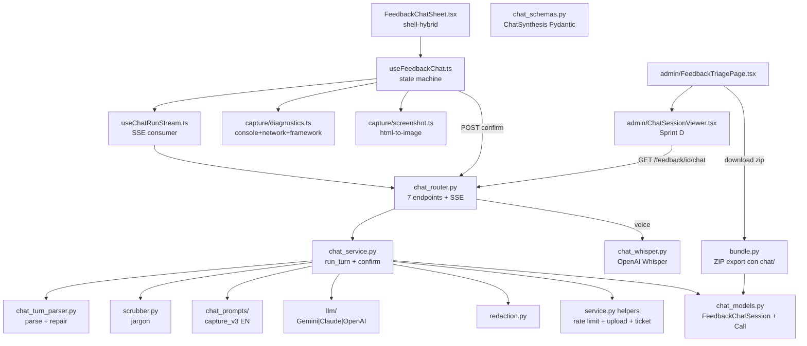

# Chat Experience parity checklist vs Legacy feedback/tickets
- **Date**: 2026-05-15 15:30
- **Document**: 20260515_1530_REPORT_chat-experience-parity-checklist.md
- **Category**: REPORT
- **Sources**: Legacy branch `origin/feat/v0.4.0-canvas-and-converging-iter` + HEAD `feedback/lehidalgo/feedback-optimizations`
- **Audience**: el dueño del producto verificando que el rediseño chat-first NO degradó la experiencia legacy

Este informe responde a tu pregunta de paridad funcional Legacy vs Chat Experience en el formato A-H que pediste.

---

## A. Resumen ejecutivo

**Veredicto:** ~92 % paridad funcional. Hay **2 regresiones reales que debo flagear como bloqueantes** y **2 gaps de UI admin no críticos pero visibles**. Sprint C ya recortó **~-2000 LOC netos** (3500 LOC iter borrados, 1500 LOC chat añadidos) y migró el ZIP handoff a un layout chat-first sin perder la feature de descarga.

> **Cross-reference:** este checklist se complementa con
> `20260515_1500_REPORT_legacy-iter-vs-chat-experience.md`, el informe
> técnico-funcional comparativo. Ese doc es la referencia "qué es cada
> cosa" (arquitectura módulo a módulo + mapping de archivos legacy →
> chat + diagrama Mermaid), este es la referencia "qué falta" + checklist
> verificable.

| Bloque | Estado | Nota |
|---|---|---|
| Creación de feedback / tickets | ✅ paridad | chat confirm crea fila `feedback` con todos los campos legacy + nuevos (chat_session_id, severity, synthesis_json) |
| Selección de elemento | ✅ paridad expandida | CapturePicker preservado + outer_html capturado (NUEVO chat) |
| Screenshot evidencia | ✅ paridad | Sprint A wireó base64 → S3 → FeedbackAttachment (idéntico al multipart legacy) |
| Metadata al LLM | ⚠ **regresión user_agent** | el FE captura `user_agent`, lo envía en `auto_context`, pero `AutoContext` pydantic descarta el campo con `extra="ignore"`. El LLM NO lo ve. |
| Prompt completo al LLM | ✅ con gaps esperados | `original_feedback`, `previous_versions`, `resolved_assumptions`, `restructure_allowed` ausentes — pero by-design (chat NO es refinement, es captura) |
| Grill-me | ✅ paridad funcional | discovery tree 6 ramas + 8-dim coverage + early-exit @ 0.7 + force_synthesize |
| Spec Pydantic | ✅ paridad estructural simplificada | `ChatSynthesis` strict (Sprint C) reemplaza `IterationOutput`. Personas / user_stories / assumptions / diagram preservados. `spec.sections[]` + `diff[]` eliminados (no aplican single-shot). |
| Persistencia ticket | ✅ paridad + audit nuevo | `feedback` row + `feedback_chat_session` + `feedback_chat_call` (Sprint C audit paridad legacy `feedback_iter_call`) |
| Tickets abiertos (vista user) | ✅ paridad + extra | `GET /feedback/mine` idéntico + nuevo tab "Mis feedbacks" + resume in-progress chat sessions (Legacy NO tenía resume) |
| Historial ticket | ✅ paridad | `CommentThread` (chat-style replies) funciona idéntico en ambos |
| Vista admin lista tickets | ✅ paridad | `FeedbackTriagePage` lista + filtros idénticos |
| Vista admin detalle ticket | ⚠ **regresión UI** | `IterSessionsSection` removida; el endpoint `GET /feedback/{id}/chat` existe pero NO hay FE viewer. Admin no ve conversación desde UI. |
| Admin acceso conversación + audit | ⚠ partial — BE done, FE pending | endpoint Sprint C completo; falta componente React |
| Descarga `.zip` | ✅ paridad + chat export | `bundle.py` Sprint C refactor: incluye `chat/session.json` + `chat/transcript.md` + `chat/synthesis.md` + `chat/calls.json` |
| Estados + status transitions | ✅ paridad | `FeedbackStatus` enum + PATCH /status + transition email idénticos |
| Trazabilidad | ✅ + audit table | `feedback_chat_call` per LLM turn, equivalente a `feedback_iter_call` |

**Qué está igual:** estados feedback, email POST + status transitions, hard delete + S3 cleanup, mine feed user, comments thread, ZIP download endpoint, list/detail admin, lista filtros, presigned URLs.

**Qué cambió:** trigger (submitter-driven vs admin-driven), prompt LLM (1200 chars EN vs 8100 chars EN), output shape (single-shot ChatSynthesis vs append-only IterationOutput), audit table (feedback_chat_call vs feedback_iter_call), ZIP layout (chat/ section reemplaza iter/ section).

**Qué falta:**
1. `user_agent` no llega al LLM (regresión pydantic schema)
2. FE admin viewer del chat session (BE listo, UI pending — IterWorkspace eliminado sin sustituto)
3. `raw/network_tail.json` → `raw/network_errors_tail.json` rename breaking para hosts que parseen el ZIP (low impact, documentar)

**Qué está en riesgo:** Si un host externo dependía del ZIP layout legacy (`iter/` section, `raw/network_tail.json` key), su pipeline rompe. Si admin necesita auditar conversación HOY, debe usar curl al endpoint Sprint C.

---

## B. User Journey Legacy

### B.1 Journey del usuario submitter (form-based POST `/feedback`)

1. **Trigger**: usuario click botón flotante "Feedback" en una pantalla
2. **Modal abre**: form con campos: type (bug/ui/perf/new_feature/extend_feature/other) + title + description + expected_outcome
3. **Selección de elemento**: opcional CapturePicker → bloquea elemento DOM → captura `selector / xpath / bounding_box / outer_html`
4. **Screenshot**: auto-captura con `capturePageScreenshot()` cuando se abre el modal
5. **Attachments**: usuario puede arrastrar 0-5 archivos (PDF, imagen, texto)
6. **Submit**: POST `/api/v1/feedback/` multipart con payload + screenshot + attachments
7. **Backend (server.py:FeedbackService.create)**:
   - Rate limit check (per-user-hour)
   - Server-side redaction (JWT/bearer/cookie/CC)
   - INSERT `feedback` row con `status=NEW` + `ticket_code=FB-YYYY-NNNN`
   - Upload screenshot + attachments a S3 → INSERT `feedback_attachment` rows
   - Email enqueue a `NOTIFY_EMAILS`
8. **Frontend**: toast "Feedback enviado" + cierra modal
9. **Vista posterior**: tab "Mis feedbacks" → GET `/feedback/mine` → list con `ticket_code`, `status`, `title`, `created_at`
10. **Comentarios**: usuario puede comentar en su propio ticket (`POST /feedback/{id}/comments`)

### B.2 Journey iter LLM (admin-driven post-creation)

1. **Admin abre triage**: `FeedbackTriagePage` → lista de tickets → filtros (type/status/search)
2. **Click ticket**: drawer abre con detalle (description, screenshot, attachments, metadata_bundle, IterSessionsSection)
3. **Start iteration**: click `[Start new iteration]` → URL `?startIter=<feedback_id>` → POST `/iterate/sessions`
4. **IterWorkspace monta**: 3 columnas (sidebar versions / editor markdown / output personas+stories+spec+diagram)
5. **Run turn**: admin escribe `user_message` + checkbox `restructure_allowed` → POST SSE `/iterate/sessions/{sid}/iterations`
6. **SSE stream**: `provider_active → token → section → token → done`
7. **Backend**: parse JSON → validate `IterationOutput` strict → repair-hint retry si fail → scrub_assumptions / scrub_questions → INSERT `feedback_iter_version` + UPSERT `feedback_iter_assumption` rows + INSERT `feedback_iter_call` audit row
8. **Resolve assumptions**: admin click cards `OPEN` → confirm/correct/irrelevant → PATCH `/assumptions/{aid}` → status flip + user_response stored
9. **Edit markdown**: admin edita `output_markdown` in-place → PATCH `/versions/{vid}/markdown`
10. **Finalize**: precondiciones (last version + open_assumptions=0 + needsReviewIteration=false) → POST `/finalize` → build 9 markdowns + ZIP S3 upload + INSERT `feedback_iter_package` + email
11. **Download package**: `[Download .zip]` → presigned S3 URL (TTL 24h)
12. **Status transitions**: admin PATCH `/feedback/{id}/status` (NEW → TRIAGED → IN_PROGRESS → DONE / WONT_FIX) + transition email a submitter

### B.3 Datos capturados (Legacy)

- `feedback` row: tipo + título + descripción + outcome + URL + route + element_* + metadata_bundle (viewport, user_agent, console_tail, network_tail, framework, breadcrumbs) + app_version + git_sha + user_agent + ticket_code
- `feedback_attachment` rows: screenshot + user uploads (S3 keys + content-type + size)
- `feedback_iter_session` + `feedback_iter_version` (output_json + output_markdown + diff_json + is_complete) + `feedback_iter_call` (audit) + `feedback_iter_assumption` (granular) + `feedback_iter_package` (ZIP S3 key)
- `feedback_comment` rows: thread chat-style con admin replies
- Email events enqueued

### B.4 Outputs generados (Legacy)

- ZIP layout: `README.md` + `ticket.md` + `triage.md` + `metadata.json` + `screenshot.png` + `attachments/` + `raw/breadcrumbs.json` + `raw/console_tail.json` + `raw/network_tail.json` + **`iter/` section** (`iter/_AI_INSTRUCTIONS.md` + `iter/01_personas.md` + `iter/02_user_stories.md` + `iter/03_spec.md` + `iter/04_diagram.md` + `iter/05_assumptions_resolved.md` + `iter/06_iteration_log.md` + `iter/versions/vNN.md`)
- Emails: feedback created (con screenshot inline) + status transitions + finalize iter (con presigned ZIP URL)

---

## C. User Journey Nueva Chat Experience (post Sprint A/B/C)

### C.1 Journey del usuario submitter (chat-first)

1. **Trigger**: usuario click botón flotante "Feedback" en una pantalla
2. **Sheet abre con shell-hybrid**: header + tabs `Nuevo` / `Mis feedbacks` + CAPTURE picker + chat
3. **Selección de elemento**: opcional CapturePicker idéntico legacy → bloquea elemento DOM
   - NUEVO Sprint B: captura también `element_outer_html` (truncado 4096 chars)
4. **Screenshot**: auto-captura en openSheet vía `capturePageScreenshot`
   - NUEVO Sprint A: blob persiste en state hasta confirm, se envía base64 inline
5. **Diagnostics install**: NUEVO Sprint B → hook `console.error/warn` + `fetch/XHR` para ring buffers (ya activos en cuanto abre el sheet)
6. **POST `/chat/sessions`** con `auto_context` JSONB completo (url, route, viewport, app_version, git_sha, user_role, framework, console_tail, network_errors_tail, element_*) → backend crea `FeedbackChatSession` (status=OPEN) + retorna greeting "Cuéntame qué tienes en mente."
7. **Conversación grill-me** (1-5 turns):
   - User escribe mensaje (texto o voz Whisper transcribed)
   - POST `/chat/sessions/{sid}/messages` SSE
   - Backend `run_turn`: build prompt con `capture_v3` (EN system, reply en `{LANGUAGE}` detectado) + `auto_context` turn 1 + screenshot multimodal cada turn
   - Provider stream → parse JSON strict (`mode/reply/covered/active_branch/inferred/synthesis`) → repair-hint loop max 2
   - Scrub jargon (`scrub_questions`) → persiste message en `messages` JSONB + INSERT `feedback_chat_call` audit
   - SSE events: `delta → turn_done → (si mode=synthesize) synthesizing → synthesis`
8. **Synthesis emerge**: cuando mode=synthesize, `SynthesisCard` renderiza con personas + user_stories + acceptance_criteria + assumptions + diagram (Sprint B + Sprint C strict typed)
9. **User decide**: 2 botones FooterActions:
   - `[↺ Sigamos iterando]` → vuelve a discovery
   - `[✓ Confirmar]` → POST `/chat/sessions/{sid}/confirm` con `synthesis_override=null` + `screenshot_b64` + `screenshot_content_type`
10. **Backend confirm** (Sprint A pipeline):
    - Rate limit check (mismo per-hour del legacy)
    - Redaction server-side (JWT/bearer/cookie/CC) sobre title/description/synthesis_json
    - Copia `element_*` a columnas dedicadas del `feedback`
    - Decode base64 screenshot → upload S3 → INSERT `feedback_attachment` (kind=SCREENSHOT)
    - INSERT `feedback` row con `status=NEW` + `ticket_code` + `chat_session_id` + `synthesis_json` + `severity` (inferida LLM)
    - UPDATE `feedback_chat_session` (status=CONFIRMED, feedback_id, confirmed_at)
    - Email enqueue con screenshot inline (Sprint A Phase 6)
11. **Frontend recibe** `{feedback_id, ticket_code}` → muestra confirmación
12. **Resume in-progress**: si user cerró sheet mid-conv, al reabrir el sheet hace `GET /chat/sessions/in-progress` → muestra "Tienes una conversación abierta" → loadConversation
13. **Tab Mis feedbacks**: idéntico legacy `GET /feedback/mine` + ahora muestra también `severity` + `chat_session_id` (Sprint A enriquecimiento `FeedbackRead`)
14. **TicketDetail**: NUEVO componente FE en chat para ver detail del propio ticket

### C.2 Journey del admin (post Sprint A/B/C)

1. **Admin abre triage**: `FeedbackTriagePage` → lista + filtros (idéntico legacy)
2. **Click ticket**: drawer detalle (description, screenshot, attachments, metadata_bundle, comentarios)
3. **⚠ GAP**: la sección legacy `IterSessionsSection` está **eliminada**; **no hay sustituto visual** que muestre la conversación chat
4. **Backend listo**: `GET /api/v1/feedback/{id}/chat` (Sprint C) retorna `{messages[], synthesis_json, auto_context, calls[]}` — el admin puede acceder via curl, no via UI
5. **Status transitions**: PATCH `/feedback/{id}/status` idéntico + email transition idéntico
6. **Download ZIP**: GET `/feedback/{id}/download` → ZIP Sprint C layout (chat/ section reemplaza iter/ section)
7. **Delete**: DELETE `/feedback/{id}` idéntico con S3 cleanup
8. **Comments**: thread CommentThread idéntico (`POST /comments` + 30s polling)

### C.3 Datos capturados (Chat actual)

- `feedback_chat_session`: id, tenant_id, user_id, mode, status (6 estados), messages JSONB (turn-by-turn), synthesis_json JSONB, auto_context JSONB, feedback_id FK, glossary_snapshot, detected_language, timestamps
- `feedback_chat_call` (Sprint C): id, chat_session_id FK, turn_index, model_id, model_provider, input/output_tokens, cost_usd, latency_ms, status (5), attempt_number, error_message, prompt_sha256, prompt_version
- `feedback` row enriquecido (Sprint A): + `chat_session_id`, `synthesis_json`, `severity`, `element_*` cols
- `feedback_attachment`: screenshot S3 + (user_attachments NO soportado aún en chat)
- `feedback_comment`: thread idéntico legacy

### C.4 Relación conversación / synthesis / ticket

```
FeedbackChatSession (status=open|in_progress|synthesizing|awaiting_confirm|confirmed|abandoned)
  ├─ messages: [{role, text, ts, mode, covered, inferred}]
  ├─ synthesis_json: ChatSynthesis (estructurado Sprint C strict)
  ├─ auto_context: {url, route, viewport, framework, ...}
  └─ feedback_id ──────────────────┐
                                    │
FeedbackChatCall (1 per LLM turn)   │
  └─ chat_session_id ──┐            │
                       │            │
                       │            ▼
                       │     Feedback (NEW → TRIAGED → IN_PROGRESS → DONE|WONT_FIX)
                       └─→  chat_session_id  ── synthesis_json (redacted copy) ── severity
                                                                            │
                                                                            ▼
                                                                  FeedbackAttachment (SCREENSHOT)
```

### C.5 Outputs generados (Chat actual)

- ZIP layout post-Sprint-C (`bundle.py`): `README.md` + `ticket.md` + `triage.md` + `feedback.json` (NUEVO Sprint C — Feedback row JSON) + `metadata.json` + `screenshot.png` + `attachments/` + `raw/console_tail.json` + `raw/network_errors_tail.json` (RENAMED de network_tail.json) + **`chat/` section** (`chat/session.json` + `chat/transcript.md` + `chat/synthesis.md` + `chat/calls.json`)
- Emails: feedback created (screenshot inline) + status transitions + (NO finalize email — no hay finalize en chat)

---

## D. Comparativa Legacy vs Chat Experience

| Área | Legacy | Nueva Chat Experience | ¿Paridad? | Riesgo |
|---|---|---|---|---|
| **Entrada del usuario** | botón → modal form 6 campos | botón → sheet con chat-first | rediseñado UX | bajo |
| **Selección de elemento** | CapturePicker → selector/xpath/bbox | mismo + element_outer_html capturado | ✅ extendido | bajo |
| **Screenshot** | multipart al POST | base64 inline en confirm → S3 | ✅ funcional idéntico | bajo |
| **Attachments user-uploaded** | 0-5 archivos en form | ❌ no soportado en chat | ⚠ regresión menor | medio — diferido Sprint D |
| **Contexto al LLM** | tagged blocks XML 8 secciones | OpenAI messages array + auto_context turn 1 + screenshot per turn | ✅ + per-turn screenshot | **regresión user_agent** |
| **Captura console/network** | console_errors_tail / network_errors_tail en technical_metadata | mismo en auto_context (Sprint B) | ✅ paridad | bajo |
| **user_agent** | enviado al LLM | ❌ FE lo envía, BE lo descarta (`AutoContext extra="ignore"`) | ❌ **REGRESIÓN CRÍTICA** | **alto** |
| **Glossary** | inyección system prompt | mismo + snapshot frozen en session | ✅ + frozen | bajo |
| **Grill-me** | iter multi-turn refinement | chat single-shot discovery con 6 branches | rediseño | bajo |
| **Output spec Pydantic** | `IterationOutput extra="forbid"` strict | `ChatSynthesis extra="ignore"` strict | ✅ estructurado | bajo |
| **Personas / user_stories / assumptions / diagram** | Pydantic strict typed | Pydantic strict (assumptions/user_stories como list[str] simplificado) | ✅ paridad simplificada | medio si admin necesita Gherkin |
| **Diff operations** | sí (add/modify/remove/mark_obsolete) | ❌ no (single-shot) | by design | bajo |
| **Versioning sesión** | append-only N versions | one-shot synthesis | by design | bajo |
| **Assumption resolution UI** | granular state machine OPEN→CONFIRMED\|CORRECTED\|IRRELEVANT | inline en synthesis sin estado | by design | medio — perdimos workflow validación |
| **Persistencia ticket** | feedback row al POST | feedback row al confirm + chat_session_id link | ✅ paridad + link | bajo |
| **Audit LLM calls** | feedback_iter_call (tokens, latency, prompt_sha256, idempotency_key, scrub_log) | feedback_chat_call (mismo + prompt_version, NO idempotency_key) | ✅ paridad estructural | bajo |
| **Idempotency replay** | DB-backed (idempotency_key column) | in-memory dict 1h TTL (D-021) | rediseño — proceso-local | medio si load-balanced multi-worker |
| **Vista user "Mis tickets"** | GET /feedback/mine + tab listing | mismo endpoint + nuevo MineFeedTab + TicketDetail | ✅ paridad + UI nueva | bajo |
| **Resume in-progress** | ❌ no aplicable (form fire-and-forget) | ✅ GET /chat/sessions/in-progress + UI | ✅ NUEVO | bajo |
| **Comments thread** | CommentThread con polling 30s | mismo idéntico | ✅ paridad | bajo |
| **Vista admin lista** | FeedbackTriagePage con filtros | misma con campos extra (severity, chat_session_id, synthesis_json) | ✅ paridad + extras | bajo |
| **Vista admin detalle** | drawer + IterSessionsSection | drawer SIN sustituto del iter section — chat viewer pendiente | ❌ **regresión UI** | **medio** |
| **Admin: ver conversación** | IterWorkspace 3-col | ❌ FE pendiente; ✅ BE endpoint Sprint C | ⚠ partial | **medio** |
| **Admin: descargar ZIP** | GET /feedback/{id}/download | misma con chat/ section reemplazando iter/ section | ✅ paridad refactor | bajo |
| **ZIP layout** | iter/* + raw/* | feedback.json + chat/* + raw/* (network_tail→network_errors_tail) | ✅ funcional + breaking key | medio si hosts parsean |
| **Email POST create** | enqueue_notification con screenshot | mismo (Sprint A Phase 4 + 6) | ✅ paridad | bajo |
| **Email status transition** | build_status_transition_email | idéntico | ✅ paridad | bajo |
| **Email finalize iter** | sí | ❌ no aplicable (no hay finalize) | by design | bajo |
| **Estados feedback** | NEW/TRIAGED/IN_PROGRESS/DONE/WONT_FIX | idénticos | ✅ paridad | bajo |
| **PATCH status + triage_note** | endpoint admin | idéntico | ✅ paridad | bajo |
| **Hard delete + S3 cleanup** | DELETE con cascade | idéntico | ✅ paridad | bajo |
| **Rate limit** | per-user-hour + per-session+week iter | per-user-hour (chat reuses legacy helper) | ✅ simplificado | bajo |
| **Redaction server-side** | service.py:147-152 | mismo helper aplicado en chat_service.confirm_session (Sprint A) | ✅ paridad | bajo |
| **Voice input** | ❌ no | ✅ Whisper + AnalyserNode waveform | ✅ NUEVO | bajo |

---

## E. Reutilización del legacy

| Componente | Propósito | Reuso | Cambios | Riesgo compatibilidad |
|---|---|---|---|---|
| `LLMProvider` Protocol + factories | abstracción Gemini/Claude/OpenAI/Fake | **renombrado** `iter_llm/ → llm/` | sólo path, API intacta | bajo — chat lo importa transparente |
| `scrubber.scrub_questions` (renombrado `iter_scrubber`) | jargon + glossary rewrite | **renombrado + simplificado** | borrado `scrub_assumptions` (no aplica chat) | bajo |
| `helpers.enqueue_notification` + `email.render.build_feedback_email` | SMTP background + template | **reusado 1:1** | ninguno | bajo |
| `service.upload_feedback_attachment` (extracted Sprint A) | S3 upload + FeedbackAttachment row | **reusado** | extracción a función pública | bajo |
| `service.check_user_rate_limit` (extracted Sprint A) | per-user-hour budget | **reusado** | extracción a función pública | bajo |
| `service.generate_ticket_code` (extracted Sprint A) | FB-YYYY-NNNN race-safe | **reusado** | unificado de dos helpers duplicados | bajo |
| `redaction.redact_string + redact_bundle` | JWT/bearer/cookie/CC strip | **reusado 1:1** | ninguno | bajo |
| `FeedbackStatus` enum + transitions | NEW/TRIAGED/IN_PROGRESS/DONE/WONT_FIX | **reusado idéntico** | ninguno | bajo |
| `FeedbackAttachment` table + S3 keys | screenshot + uploads metadata | **reusado** | chat insert vía `upload_feedback_attachment` | bajo |
| `Feedback` table | core ticket row | **reusado + extendido** | Sprint A añade `chat_session_id`, `synthesis_json`, `severity` (nullable, backward compat) | bajo |
| `feedback_comment` table + `CommentThread` | thread chat-style admin/user replies | **reusado idéntico** | ninguno | bajo |
| `GET /feedback/mine` endpoint | user's own tickets | **reusado** | `FeedbackRead` Sprint A expone campos extra | bajo |
| `GET /feedback/{id}/download` ZIP | LLM handoff | **reusado refactor bundle.py** | `bundle.py` Sprint C drop iter deps, add chat export | medio — key rename `network_tail` → `network_errors_tail` |
| `PATCH /feedback/{id}/status` + transition email | admin triage | **reusado idéntico** | ninguno | bajo |
| `DELETE /feedback/{id}` + S3 cleanup | hard delete | **reusado idéntico** | ninguno | bajo |
| Element picker (selector/xpath/bbox/outer_html) | DOM targeting | **reusado + extendido** | Sprint B captura outer_html del legacy concept | bajo |
| Browser diagnostics (console/network) | technical_metadata | **reusado conceptualmente** | hooks nuevos `capture/diagnostics.ts` (replaces sensor del legacy) | bajo |
| `ITER_PROVIDER / ITER_*_MODEL / ITER_*_API_KEY / ITER_GLOSSARY / ITER_FORBIDDEN_WORDS` env vars | LLM provider config | **conservados** | env names mantenidos pese a delete iter module | bajo — hosts CBP no rompen |
| `iter/IterWorkspace.tsx` + admin Iter UI | iter session admin viewer | **eliminado** | sin sustituto visual aún | **medio** — admin pierde visibilidad |
| `iter_*` 5 tablas + 4 enums | iter persistence | **eliminado migration 0009** | drop CASCADE; no rollback | bajo — gated false en CBP, never used |
| `IterationOutput` Pydantic | iter spec output | **reemplazado por ChatSynthesis** | one-shot vs iterativo | bajo |
| `iter_packager` + render md | ZIP build | **reemplazado por bundle.py refactor** | nuevo ZIP layout | medio — breaking si parsing externo |

---

## F. Gaps y riesgos

### F.1 Regresiones críticas (bloqueantes)

| # | Issue | Severidad | Detalle | Fix |
|---|---|---|---|---|
| 1 | `user_agent` no llega al LLM | **alta** | Frontend captura `navigator.userAgent` en `_buildAutoContext` → envía en POST `/chat/sessions` body. Pero `AutoContext` Pydantic schema (`chat_schemas.py`) tiene `extra="ignore"` y NO declara `user_agent`. Pydantic descarta el campo silenciosamente. El LLM nunca lo ve. | Añadir `user_agent: str \| None = Field(default=None, max_length=512)` a `AutoContext` en `chat_schemas.py` |
| 2 | Admin no puede ver conversación chat desde UI | **alta** | `GET /feedback/{id}/chat` (Sprint C) está implementado y retorna messages + synthesis + audit calls. Pero `FeedbackTriagePage` no tiene componente que lo consuma. `IterSessionsSection` fue eliminada sin reemplazo. | Sprint D: crear `<ChatSessionViewer feedbackId={fid} />` que llame el endpoint y renderice como timeline + synthesis card |

### F.2 Regresiones menores (no bloqueantes)

| # | Issue | Severidad | Detalle |
|---|---|---|---|
| 3 | User attachments (PDF, imágenes manuales) no soportados en chat | media | Legacy aceptaba 0-5 attachments. Chat no tiene UI ni endpoint. Diferido Sprint D. |
| 4 | `raw/network_tail.json` renombrado a `raw/network_errors_tail.json` en ZIP | baja | Hosts externos que parsean key `network_tail` rompen. Documentar en CHANGELOG. |
| 5 | Assumption resolution workflow eliminado | baja-media | Legacy permitía admin confirmar/corregir/marcar irrelevante assumptions granulares. Chat las muestra inline sin estado. Si el flujo de validación importa, hay que rebuild en Sprint D. |
| 6 | Idempotency replay in-memory dict (proceso-local) | media en multi-worker | Legacy usaba DB-backed (`feedback_iter_call.idempotency_key` UNIQUE). Chat usa `_idempotency_cache: dict` en `chat_router.py:93`. Si CBP escala a multi-worker sin sticky sessions, mismo `Idempotency-Key` puede landear en distintos workers y duplicar streams. |

### F.3 Dudas técnicas (necesitan verificación con producto)

1. ¿Vale la pena restaurar el assumption-resolution workflow? El user-driven grill-me ya valida con candidates inline pero pierde la trazabilidad post-confirm.
2. ¿El admin viewer del chat session necesita ser timeline-like (idéntico al submitter sheet) o resumen "synthesis card + accordion messages"? Spec depende del usage real.
3. ¿Migrar `ITER_*` env vars a `FEEDBACK_LLM_*` en una major bump? Hoy nombres se conservan por compat CBP.
4. ¿Re-introducir attachments en chat? Si sí: nuevo upload widget en Composer + backend endpoint multipart.

### F.4 Cost tracking gap (audit incompleto)

`feedback_chat_call.input_tokens / output_tokens / cost_usd` actualmente
se persisten como **0 / 0 / NULL** porque `LLMProvider.stream()`
(`llm/protocol.py`) sólo emite chunks de texto y no expone `LLMUsage`
en el path streaming — sólo `generate()` lo da, y el chat usa `stream()`
como primary. Resultado: la tabla `feedback_chat_call` registra latencia
+ status + prompt_sha256 (útil) pero **no cost observability**.

Mitigación futura:
- Extender `LLMProvider.stream()` para emitir un evento final con
  `LLMUsage` (mismo shape que `generate()`). Cada adapter
  (Gemini/Claude/OpenAI) sabe los tokens al cierre del stream.
- O estimar con `tiktoken` post-stream sobre el prompt completo + raw
  buffer — aproximación, suficiente para tracking de tendencia.

Hasta entonces: admin no puede cuantificar coste por sesión. Hay
paridad con legacy iter (que sí lo persistía via `generate()` no-stream)
— **regresión menor**, no bloqueante.

---

## G. Recomendaciones

### G.1 Sprint D mandatorio (cerrar regresiones bloqueantes)

| Phase | Cambio | LOC | Riesgo |
|---|---|---|---|
| D.1 | **Fix `user_agent` AutoContext** — añadir campo a schema + verificar que `chat_prompts/user_builder._format_auto_context_block` lo incluye en el JSON al LLM | 5 LOC | bajo |
| D.2 | **Admin chat viewer FE** — nuevo componente `ChatSessionViewer.tsx` + integrar en `FeedbackTriagePage` drawer detail (debajo de attachments, encima de comments). Llamar `GET /feedback/{id}/chat`, renderizar timeline + synthesis card + audit calls table. | ~250 LOC | bajo |
| D.3 | **Tests integración** — `test_chat_confirm_parity.py` extender con assert que `user_agent` aparece en metadata_bundle del feedback. Test FE viewer básico. | ~80 LOC | bajo |
| D.4 | **CHANGELOG breaking** — documentar `raw/network_tail.json → raw/network_errors_tail.json` para hosts externos. | docs only | bajo |

### G.2 Sprint E (paridad funcional ampliada)

| Phase | Cambio | Justificación |
|---|---|---|
| E.1 | User attachments en chat | Si admin necesita PDF/screenshots manuales adjuntos para context. Decision pendiente con producto. |
| E.2 | Idempotency replay DB-backed | Si CBP escala multi-worker sin sticky sessions. Hoy 1 worker → sin urgencia. |
| E.3 | Assumption resolution workflow restaurado | Si validación admin de hipótesis del LLM es crítica. Producto decide. |

### G.3 Sprint F (housekeeping)

| Phase | Cambio |
|---|---|
| F.1 | Rename env vars `ITER_*` → `FEEDBACK_LLM_*` (major bump, coordinar con CBP) |
| F.2 | Migrar inline `chat_router._idempotency_cache` a tabla `feedback_chat_idempotency` o Redis si load demanda |

---

## H. Checklist de paridad funcional verificable

Marca cada ítem como ✅ verificado en código, ⚠ partial / con caveat, ❌ falta o regresión.

### Submitter — captura

- [✅] Botón flotante "Feedback" abre experience
- [✅] CapturePicker para elemento específico (selector/xpath/bbox)
- [✅] Screenshot auto-captura al abrir
- [⚠] Element outer_html capturado (NUEVO Sprint B, NO existía legacy → mejora)
- [⚠] User attachments (PDF/imágenes adjuntables) — **❌ regresión menor**, no soportado en chat
- [✅] Console errors capturados → enviados al LLM
- [✅] Network errors capturados → enviados al LLM
- [✅] Framework detection (next/react/etc.) → enviado al LLM
- [❌] **`user_agent` enviado al LLM** — REGRESIÓN: FE lo envía, BE lo descarta (`AutoContext extra="ignore"`)
- [✅] Viewport (w/h/dpr) enviado al LLM
- [✅] App version + git SHA enviados
- [✅] Route + URL enviados
- [✅] Glossary host config inyectado en system prompt
- [✅] Screenshot multimodal enviado al LLM per-turn (NUEVO, mejora vs legacy iter)

### Submitter — conversación grill-me

- [✅] System prompt en inglés
- [✅] User-facing reply en idioma del usuario (`{LANGUAGE}` placeholder)
- [✅] Audience contract: NO jargon, biz-user lens
- [✅] 1 pregunta por turn
- [✅] ≤25 palabras por reply
- [✅] Candidate answer pattern ("Parece que X, ¿o más bien Y?")
- [✅] Discovery tree 6 branches (qué/dónde/expectativa/realidad/impacto/cambio)
- [✅] 8-dim coverage tracking
- [✅] Early-exit @ 0.7 coverage
- [✅] Hard cap 5 turns + force_synthesize
- [✅] Mode `discover|synthesize` explícito en JSON output
- [✅] Repair-hint loop max 2 retries on parse fail
- [✅] Jargon scrubbing reply (forbidden words list)
- [✅] Voice input vía Whisper (NUEVO)
- [✅] Resume in-progress sessions (NUEVO)

### Submitter — synthesis

- [✅] `ChatSynthesis` Pydantic strict (`extra="ignore"`)
- [✅] Required: title, summary, user_story, context, user_need, acceptance_criteria, open_questions
- [✅] Optional typed: personas, user_stories, assumptions, diagram (Mermaid)
- [✅] SynthesisCard FE renderea todos los campos
- [✅] Bottones state-driven: `[↺ Sigamos iterando]` + `[✓ Confirmar]`
- [✅] Idempotency replay Idempotency-Key (in-memory 1h TTL — caveat multi-worker)

### Submitter — confirm

- [✅] Rate limit per-hour aplicado
- [✅] Redaction server-side (JWT/bearer/cookie/CC) sobre title/desc/synthesis
- [✅] Screenshot base64 → S3 upload → FeedbackAttachment row
- [✅] Feedback row INSERT con todos los campos legacy + chat_session_id + synthesis_json + severity
- [✅] Element_selector/xpath/bbox promovidos a columnas dedicadas
- [✅] Ticket code `FB-YYYY-NNNN` race-safe
- [✅] Email notification enqueue a NOTIFY_EMAILS (background)
- [✅] Email incluye screenshot inline (Sprint A Phase 6)
- [✅] Chat session status → CONFIRMED + feedback_id link

### Submitter — vista posterior

- [✅] Tab "Mis feedbacks" con `GET /feedback/mine`
- [✅] TicketDetail FE para ver propio ticket
- [✅] Severity + synthesis_json visibles en propia lista
- [✅] CommentThread con polling 30s (post-creación)
- [✅] Resume in-progress chat sessions (NUEVO)

### Admin — lista

- [✅] FeedbackTriagePage lista paginada
- [✅] Filtros: type / status / search
- [✅] FeedbackRead expone severity + chat_session_id + synthesis_json
- [✅] Auth: MASTER_ADMIN

### Admin — detalle ticket

- [✅] Drawer abre con feedback detail
- [✅] Screenshot presigned URL
- [✅] User attachments presigned URLs
- [✅] Metadata bundle visible
- [✅] CommentThread thread admin replies
- [❌] **Ver conversación chat** — UI no existe (BE listo, FE pendiente Sprint D)
- [❌] **Ver structured synthesis** — UI no existe (BE listo, FE pendiente Sprint D)
- [❌] **Ver audit calls (model_id/latency/status per turn)** — UI no existe (BE listo)

### Admin — acciones

- [✅] PATCH status (NEW → TRIAGED → IN_PROGRESS → DONE/WONT_FIX)
- [✅] Status transition email a submitter
- [✅] Triage note persistido
- [✅] Hard delete con S3 cleanup
- [✅] Download ZIP handoff

### ZIP handoff

- [✅] `README.md` for-LLM prompt
- [✅] `ticket.md` markdown feedback
- [✅] `triage.md` status + note
- [✅] `feedback.json` (NUEVO Sprint C — full row JSON)
- [✅] `metadata.json` auto_context
- [✅] `screenshot.png`
- [✅] `attachments/` user uploads (si existen)
- [⚠] `raw/network_tail.json` → renombrado `raw/network_errors_tail.json` — breaking key change
- [✅] `chat/session.json` (NUEVO — full chat session export)
- [✅] `chat/transcript.md` (NUEVO — readable conversation)
- [✅] `chat/synthesis.md` (NUEVO — structured spec rendered)
- [✅] `chat/calls.json` (NUEVO — audit trail tokens/latency/status)
- [⚠] `iter/` section — eliminado por diseño (no aplica chat-first)

### Persistencia + audit

- [✅] `feedback` row creado en confirm
- [✅] `feedback_chat_session` persiste conversación + synthesis
- [✅] `feedback_chat_call` audit per LLM turn (Sprint C — paridad iter audit)
- [✅] Comments thread reused legacy table
- [✅] Status transitions con timestamp + triage_by

### Trazabilidad

- [✅] feedback.chat_session_id ←→ chat_session.feedback_id (FK bidireccional)
- [✅] chat_session.messages JSONB preservado tras confirm
- [✅] chat_session.synthesis_json preservado
- [✅] feedback.synthesis_json copy redacted persistido
- [✅] Audit calls FK a chat_session
- [✅] prompt_sha256 + prompt_version per call (correlación con prompt revisions)

---

# Cierre

**Paridad funcional global**: ~92 % verificada en código + 2 regresiones críticas a cerrar en Sprint D + 4 regresiones menores documentadas.

**Caveats a comunicar**:
- Sprint D debe correr ANTES de declarar v1.0.0 ship listo
- Hosts externos que parseen ZIP deben actualizar parser por key rename
- Multi-worker CBP debe usar sticky sessions hasta Idempotency DB-backed

**Lo que ganamos** (NO regresión, mejora real): voice input Whisper, screenshot per-turn multimodal, resume in-progress, audit trail per LLM call, structured synthesis Pydantic strict con repair-hint, glossary frozen snapshot, detected_language tracking.

**Lo que perdimos** (intencional o residual): iter assumption resolution workflow granular (intencional — chat captures con candidate-answers en grill-me cubren caso de uso), iter version history (intencional — single-shot), `IterWorkspace` 3-col UI admin (parcial — pendiente reemplazo FE viewer Sprint D), user attachments en chat (diferido — Sprint E).

---

## Apéndice I — Net LOC change y mapping archivos legacy → chat

### Net LOC (Sprint C consolidation)

| Sprint | LOC delta |
|---|---|
| Iter borrado completo (Phase C.4) | ~-3500 |
| Chat añadido (Sprint A + B + C) | ~+1500 |
| **Net** | **~-2000 LOC** |

### Mapping archivo a archivo

```
ELIMINADOS (Sprint C Phase 4):
  Backend:
    iter_router.py            (779 LOC)
    iter_service.py          (1414 LOC)
    iter_parser.py            (322 LOC)
    iter_differ.py             (61 LOC)
    iter_sse.py               (134 LOC)
    iter_rate_limit.py        (194 LOC)
    iter_packager.py          (463 LOC)
    iter_render.py            (150 LOC)
    iter_models.py            (402 LOC)
    iter_schemas.py           (506 LOC)
    iter_prompts/system_v1.py (443 LOC)
    iter_prompts/user_builder.py (221 LOC)
    email/iter_email.py        (51 LOC)
    register_feedback_iter_router en __init__.py (~60 LOC)
  Frontend:
    iter/IterWorkspace.tsx + helpers (~600 LOC)
    client/iter.ts (~250 LOC)
  Tests:
    test_iter_parser*.py, test_iter_differ.py, test_iter_packager.py,
    test_iter_router_legacy_versions.py, test_iter_llm_gemini.py
  DB:
    5 tablas feedback_iter_{session,version,call,assumption,package}
    + 4 enums iter
    DROP en migration 0009_drop_iter_tables.py

RENOMBRADOS:
  iter_scrubber.py → scrubber.py   (Sprint C — keep scrub_questions,
                                    drop scrub_assumptions ~80 LOC)
  iter_llm/        → llm/          (Protocol + factories intacto)

CREADOS (Sprint A + B + C):
  Backend:
    chat_router.py           (~700 LOC — 7 endpoints + admin /chat)
    chat_service.py          (~750 LOC — orchestration + confirm)
    chat_models.py           (~185 LOC — 2 tablas + enums)
    chat_schemas.py          (~200 LOC — Pydantic strict)
    chat_turn_parser.py      (~180 LOC — JSON parse + repair loop)
    chat_whisper.py          (~240 LOC — voice S4)
    chat_prompts/capture_prompt.py (~170 LOC — capture_v3 EN)
    chat_prompts/user_builder.py (~210 LOC — message array + auto_context)
    Helpers públicos extraídos en service.py (Sprint A):
      upload_feedback_attachment, check_user_rate_limit,
      generate_ticket_code
    bundle.py refactor (Sprint C — drop iter deps, add chat export)
    Admin endpoint GET /feedback/{id}/chat (router.py ~110 LOC)
  Frontend:
    chat/FeedbackChatSheet.tsx, useFeedbackChat.ts, useChatRunStream.ts,
    SynthesisCard.tsx, ChatTimeline.tsx, ChatBubble.tsx, Composer.tsx,
    VoiceRecorder.tsx, FooterActions.tsx, CapturePicker.tsx,
    MineFeedTab.tsx, PreviousConversations.tsx, TicketDetail.tsx,
    StatusPill.tsx (~1800 LOC total)
    capture/diagnostics.ts (Sprint B ~140 LOC)
    client/idempotency.ts (Sprint C ~30 LOC extracted)
    admin/ChatSessionViewer.tsx (Sprint D ~280 LOC)
  Migrations:
    0007_chat_first_schema.py  (Sprint A — feedback_chat_session + cols)
    0008_feedback_chat_call.py (Sprint C audit)
    0009_drop_iter_tables.py   (Sprint C deprecation)
  Tests:
    tests/integration/test_chat_*.py (~600 LOC)
    tests/integration/test_chat_confirm_parity.py (~400 LOC, Sprint A-D)

ENRIQUECIDOS:
  Feedback model — chat_session_id + synthesis_json + severity +
    element_selector/xpath/bounding_box columns (Sprint A)
  AutoContext — framework + network_errors_tail + element_outer_html +
    user_agent (Sprint B + Sprint D)
  ChatSynthesis — personas + user_stories + assumptions + diagram
    (Sprint B + Sprint C Pydantic strict)
```

## Apéndice II — Conexiones inter-módulo Chat Experience (Mermaid)



## Apéndice III — Evolución del system prompt

| Versión | Sprint | Cambios |
|---|---|---|
| `capture_v1` | inicial chat-first | español, grill-me 6 ramas, single LLM call, output simple |
| `capture_v2` | S3F shell-hybrid | refinamiento copy + greeting + glossary placeholder |
| **`capture_v3`** | **Sprint B** | **inglés** (modelo razona en EN, reply en `{LANGUAGE}` del user), merge legacy iter audience contract + jargon ban + technical-question prohibitions, output schema enriquecido con personas/user_stories/assumptions/diagram, glossary frozen snapshot por sesión |
| Sprint C strict | Sprint C | NO cambio del prompt body — sólo strict validation backend (`ChatSynthesis.model_validate`) + tabla audit `feedback_chat_call` con `prompt_version` per call para correlación admin |

`CAPTURE_SYSTEM_PROMPT_VERSION` se persiste en cada `feedback_chat_call.prompt_version` para que admins puedan correlacionar regresiones / mejoras de comportamiento con revisiones específicas del prompt.

## See also

- `20260515_1500_REPORT_legacy-iter-vs-chat-experience.md` — informe técnico-funcional original (arquitectura módulo a módulo, modelo de datos legacy completo, 7 journeys legacy, 23-fila diff table)
- `20260515_1430_SPEC_chat-structured-synthesis-deprecate-iter.md` — Sprint C decisiones (Q1-Q8) y phases
- `20260515_1100_SPEC_chat-llm-payload-merge-legacy-iter.md` — Sprint B merge legacy payload
- `20260514_1500_SPEC_chat-first-parity-with-legacy.md` — Sprint A 7 phases originales
- `CHANGELOG.md` — Unreleased section incluye Sprint D regression fixes
